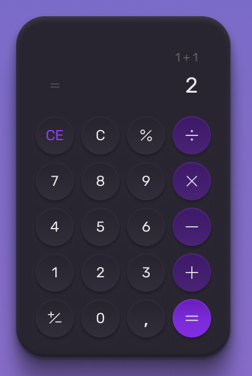

# Sprint 1 - Introdução ao Frontend 🧮

  

## Visão Geral

Bem-vindo ao repositório da **Sprint 1** do nosso grupo de estudo! Nesta sprint, vamos aprender os conceitos básicos de **Frontend** utilizando **HTML**, **CSS** e **JavaScript**. O objetivo dessa sprint é aprender os básicos do desenvolvimento web e introduzir os alunos a tecnologias que não serão vistas durante os cursos de graduação 💡✨

---

## 📚 Materiais, Tutoriais e Vídeos

Aqui você encontrará links e referências para facilitar o aprendizado:
- [Curso HTML Codecademy](https://www.w3schools.com/html/default.asp)
- [Curso CSS Codecademy](https://www.codecademy.com/enrolled/courses/learn-css)
- [W3 Schools (HTML & CSS)](https://www.w3schools.com/html/default.asp)
- [Mozilla (Documentação HTML)](https://developer.mozilla.org/pt-BR/docs/Web/HTML)
- [Playslist site dos Vingadores](https://www.youtube.com/playlist?list=PLkJ_av-2S2p97ejPxUYHbaLfX-XMfZ1F3)
- [Playslist sobre JavaScript](https://www.youtube.com/playlist?list=PL0vfts4VzfNixzfaQWwDUg3W5TRbE7CyI)
- [Flexbox Poster](https://css-tricks.com/snippets/css/a-guide-to-flexbox)
- [Grid Poster](https://css-tricks.com/snippets/css/complete-guide-grid/)

---

## 🚀 Descrição da Sprint

### Objetivo
Desenvolver uma calculadora que permita o usuário:
- Realizar cálculos básicos (adição, subtração, multiplicação, divisão);
- Mostrar na tela o resultado final;
- Realizar cálculos em sequência com o resultado do cálculo anterior;
- Poder apagar o que estiver no display da calculadora 🗑️
- Seguir o design estabelecido no Figma;

### Dicas de ouro 🪙
- Método eval() do JavaScript
- Utilizar Grid ou Flexbox para organizar os botões

---

## 🛠️ Tecnologias Utilizadas

- **HTML 5**
- **CSS 3**
- **JavaScript**

---

## 📝 Instruções para Iniciar o Projeto

1. **Criar uma pasta com o nome do repositório:**
2. **Adicionar o arquivos index.html**
3. **Adicionar o arquivos styles.css**
4. **Adicionar o arquivo script.js**
5. **Fazer o projeto seguindo um dos seguintes designs:**
  - https://www.figma.com/file/JD6x6DLOMZtDtFEPkfZRxl/Calculator-(Community)?type=design&node-id=23-142&mode=design&t=Mo3pem4KkF4RGreq-0
  - https://www.figma.com/file/4j3Drd3HOaDQeumyDG7V3e/Calculadora-%E2%80%A2-Desafio-05-(Community)?type=design&node-id=1-61&mode=design&t=Qikd9L48fAWPUqlA-0
  - https://www.figma.com/file/nKscwXvmVjdQxs7k8KOzHW/Neumorphic-Calculator-(Community)?type=design&node-id=1-2&mode=design&t=0vjCIWUvpYvrh4tQ-0
  - https://www.figma.com/file/2pFEvUQU20zoYhtDTPqWDz/Responsive-Calculator-App-(Community)?type=design&node-id=0-1&mode=design&t=TbQCtP82JG3OBmza-0
  - https://www.figma.com/file/RYsR8MV6yjKlf19hX93lJj/Calculator-App-Ui-Design-Download-Free-(Community)?type=design&node-id=65-0&mode=design&t=1EYAWd1Y3kCIV9s3-0
  - https://www.figma.com/file/Lfmj9HfPJb1w2LORQWP8Wn/iPhone-Calculator-(Community)?type=design&nodeid=1-74&mode=design&t=5eufEaLHGOLYFe81-0
    
  🏆 Quem quiser um desafio pode tentar fazer a calculadora científica do Windows 11

---

Divirta-se codando e bons estudos! 🚀✨

--------------------------------------------------
